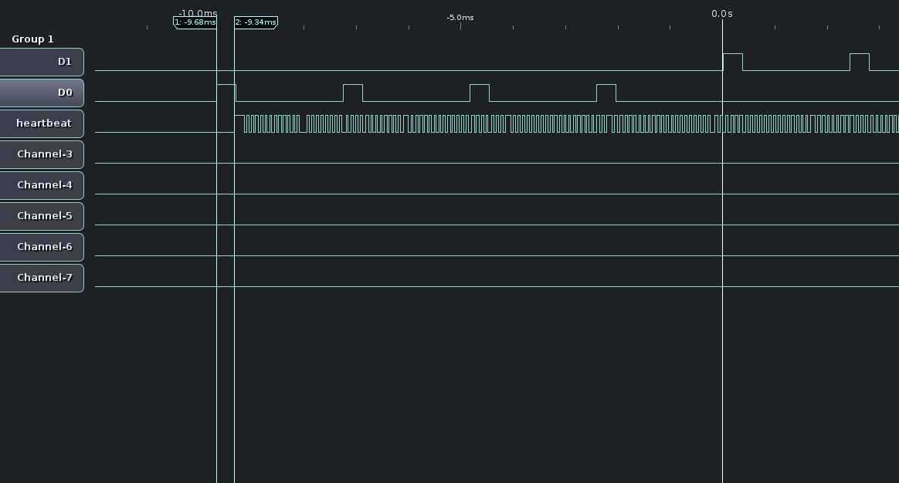
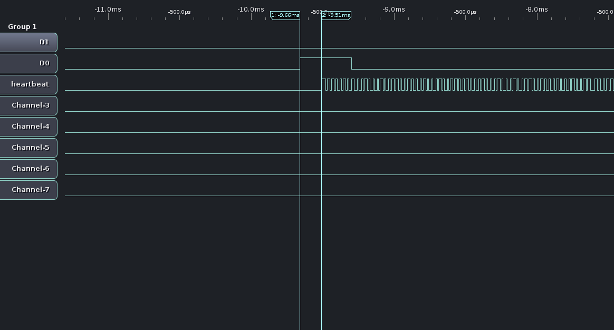
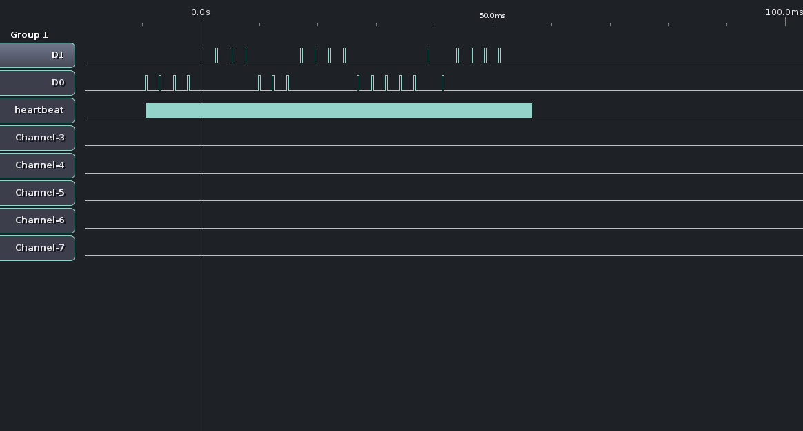

interrupt-triggered poll test
===

Setup
---

This experiment attempts to read a short series of pulses from a card reader using a combination of edge-triggered
interrupts and polling.

Pins P9_27 (GPIO_115) and P9_30 (GPIO_112) are connected to the D0 and D1 lines of a HID 6005B card reader configured
to utilize the Wiegand protocol. When a card is presented, this card reader will send a series of pulses on the D0
and D1 lines, representing a 0 or 1, respectively. Each positive-going pulse is 400us long followed by a 2000us space.
The program configures both pins as edge-triggered interrupts. It then uses poll() to wait for a transition on either
pin. Once a transition has been detected, it spins continuously, reading from both pins and checking if the value has
changed. If it sees a value change, it checks to see what direction is changed, and append the appropriate bit to the
sequence if a line saw a rising transition. If no transition is seen after 5ms, it stops spinning and displays the
bit sequence that it has read.

For this test, a 26-bit card with the value "0 0001 1110 0011 1101 1110 1000 0" will be presented to the reader. The
code read will be verified to match this known value.

Initial trials of this showed that sometimes a bit was missed. Which bit was missed was not always consistent, nor
did every trial miss a bit. This lead me to believe that the process either was unable to keep up with the transitions,
or it was not running at all times. In order to diagnose this, a debugging pin was added that provided a heartbeat
to determine the running state of the program.

Pin P9_12 (GPIO_60) was added as an output pin to write debugging timing information. The program starts with this pin
low. When the first bit is read, it toggles the state of the debug pin, indicating the latency between the input
transition and the program being able to read it. It then toggles the debug pin every time it spins through the busy
wait loop, showing that it is still active and watching. When the final bit times out, it stops toggling the debug pin.
Finally, the debug pin is set back to low when the program closes.

Observations
---

Running with normal scheduling and no background processes:
````
root@beaglebone:/home/jamesc/sktw-access/src/experiments/int_poll_test# ./test
Loop stopped with 26 bits
Loop returned retcode 0
Read code: 00001111000111100000101111 (26 bits)
````
 * 

Running with dd busy in the background, fighting for processor time:
````
root@beaglebone:/home/jamesc/sktw-access/src/experiments/int_poll_test# dd if=/dev/zero of=/dev/null &
[1] 2709
root@beaglebone:/home/jamesc/sktw-access/src/experiments/int_poll_test# ./test
Loop stopped with 4 bits
Loop returned retcode 0
Read code: 0001 (4 bits)
````
 * 
 
Recompiled with realtime scheduling and memory locking. Running with dd busy in the background:
````
root@beaglebone:/home/jamesc/sktw-access/src/experiments/int_poll_test# ./test
Loop stopped with 26 bits
Loop returned retcode 0
Read code: 00001111000111100000101111 (26 bits)
````
 * 
 * 

Conclusions
---

Even the fastest userspace software-based method could not reliably read the data from the card reader. Upon
investigation, it was found that the process wasn't always running, as it was being preempted to allow other
background tasks to run. Configuring the process to be scheduled in realtime resolved this by ensuring that
it would always preempt other userspace tasks and that it could stay running without being preempted if needed.
With this knowledge, it's possible that previous experiments (e.g. libsoc, pybbio, or bonescript) may also have
been sufficient, if only they had been scheduled in real time. More experiments are required to confirm this.

